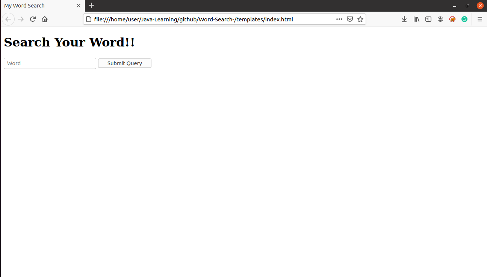

# Word Meaning Finder



>A Docker application built using python and HTML to get the meaning of a word typed.

---

## Description 

While studying for my GRE-Verbal, I realized that different websites define words differently, and give different examples. Also that it was easier to remember some and not others, because of the wordings, examples, etc. I built this application so that students like me can view multiple websites definitions in one place. 

Currently, this application uses python for the backend work, I have used python-flask to get the data from the HTML source code of the webpage. Only one website 'yourdictionary.com' is currently used, when a word is received a URL is generated using that word. From here the specific tag is found and the text in it is displayed on a webpage called by the python program. 

### Technologies 

- Python
- HTML
- Docker
- Flask

---

## Usage 

- You can use this as a stand-alone python application and run it using ```python3 app.py``` from the terminal once you download the project.
- You can also build this as a Docker container. 

---

## Author Info

 - [Linkdin](https://www.linkedin.com/in/taher-mulla) 

 - [GitHub](https://github.com/taher-mulla)

 - Email - taher.mulla@gmail.com
